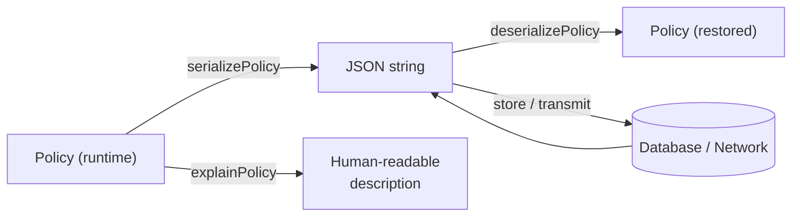

# Serialization

Policies in `@hex-di/guard` are data, not callbacks. This is a deliberate design choice that enables serialization, storage, transmission, and introspection.

## Why Policies Are Data

Most authorization libraries define policies as functions:

```typescript
// Callback-based (NOT how @hex-di/guard works)
const policy = subject => subject.permissions.has("read");
```

Functions can't be serialized, stored in databases, sent over networks, or introspected. `@hex-di/guard` instead represents policies as discriminated union trees:

```typescript
// Data-based (how @hex-di/guard works)
const policy = hasPermission(ReadUsers);
// -> { _tag: "hasPermission", permission: "ReadUsers" }
```

This enables:

- **Database storage** -- persist policies alongside resources
- **Network transmission** -- send policies to microservices
- **Audit logging** -- record the exact policy that was evaluated
- **Admin UIs** -- display and edit policies in management dashboards
- **Explanation** -- generate human-readable descriptions

## `serializePolicy()`

Converts a policy to a JSON string.

```typescript
import { serializePolicy } from "@hex-di/guard";

const json = serializePolicy(policy);
// Store in database, send over network, etc.
```

## `deserializePolicy()`

Converts a JSON string back to a policy. Returns a `Result` -- deserialization can fail if the JSON is malformed or references unknown policy kinds.

```typescript
import { deserializePolicy } from "@hex-di/guard";

const restored = deserializePolicy(json);
// Structurally identical to original
```

## Round-Trip



Serialization is lossless -- `deserializePolicy(serializePolicy(policy))` produces a structurally identical policy. This is guaranteed by the discriminated union design: every policy node has a `_tag` and known fields.

## `explainPolicy()`

Generates a human-readable description of a policy tree.

```typescript
import { explainPolicy } from "@hex-di/guard";

const explanation = explainPolicy(policy);
// "all of: has permission 'ReadUsers', has role 'Admin'"
```

Useful for:

- Audit logs that humans need to read
- Admin UIs showing what a policy does
- Debugging authorization decisions
- Error messages explaining why access was denied

## Use Cases

### Database Storage

```typescript
// Store policy with a resource
await db.resources.update(resourceId, {
  accessPolicy: serializePolicy(policy),
});

// Retrieve and evaluate
const row = await db.resources.get(resourceId);
const policy = deserializePolicy(row.accessPolicy);
const decision = evaluate(policy, subject);
```

### Network Transmission

```typescript
// API endpoint returns a policy
app.get("/api/resource/:id/policy", (req, res) => {
  const policy = getPolicyForResource(req.params.id);
  res.json({ policy: serializePolicy(policy) });
});

// Client deserializes and uses it
const response = await fetch(`/api/resource/${id}/policy`);
const { policy: json } = await response.json();
const policy = deserializePolicy(json);
```

### Audit Logging

```typescript
// Record the exact policy that was evaluated
auditTrail.record({
  subjectId: subject.id,
  policy: serializePolicy(policy),
  decision: decision.granted ? "allow" : "deny",
  timestamp: new Date(),
});
```
